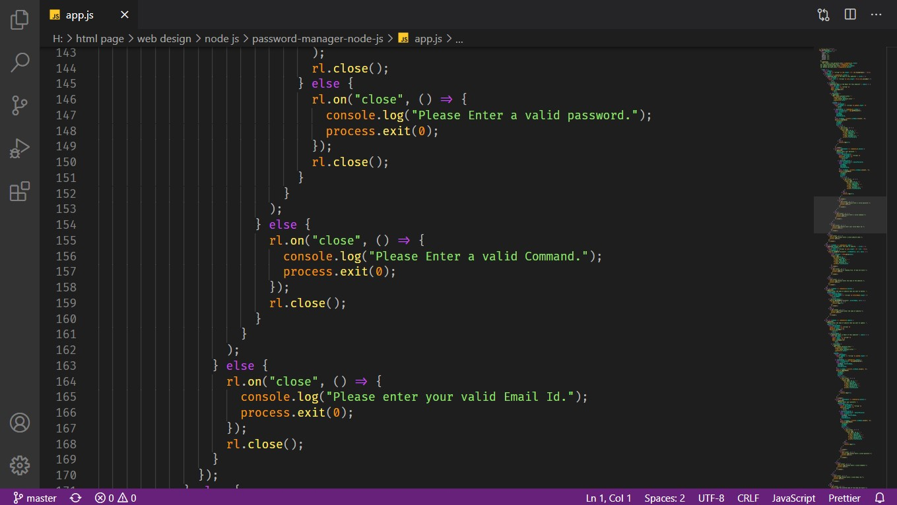

Hello,
My name is Samin Yasar. Here I created a simple Password Manager using Raw Node JS. Here you can store your all account password using your Email by generating a password or manually.

Inspired from https://www.youtube.com/watch?v=hkhyKJj28Ac

How to use it:

1. Make sure you installed Node js on your machine. You can download Node js from here https://nodejs.org/en/download/
2. Create a folder named (Password Manager).
3. Then go here https://github.com/saminyasar004/Password-Manager-Using-Node-JS 
and download all files and folders.
4. Now go to the folder which you created in your machine (step 2).
5. Copy from all files and folders which you download in (step 3).
6. Paste all in your created folder (step 2).
7. Now open the terminal and go to the created folder directory (step 2).
8. Type node app
9. Follow all directions step by step.
10. Now enjoy...

Follow me on:

1. Facebook: https://www.facebook.com/samin.yasar.2004/
2. Instagram: https://www.instagram.com/saminyasar04/
3. Github: https://github.com/saminyasar004

So let's enjoy... Happy Coding.
